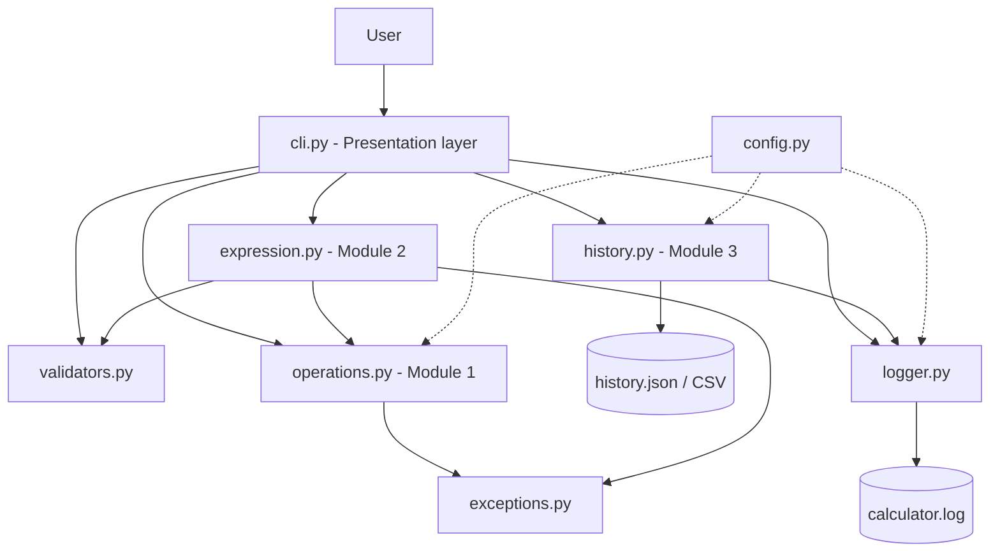
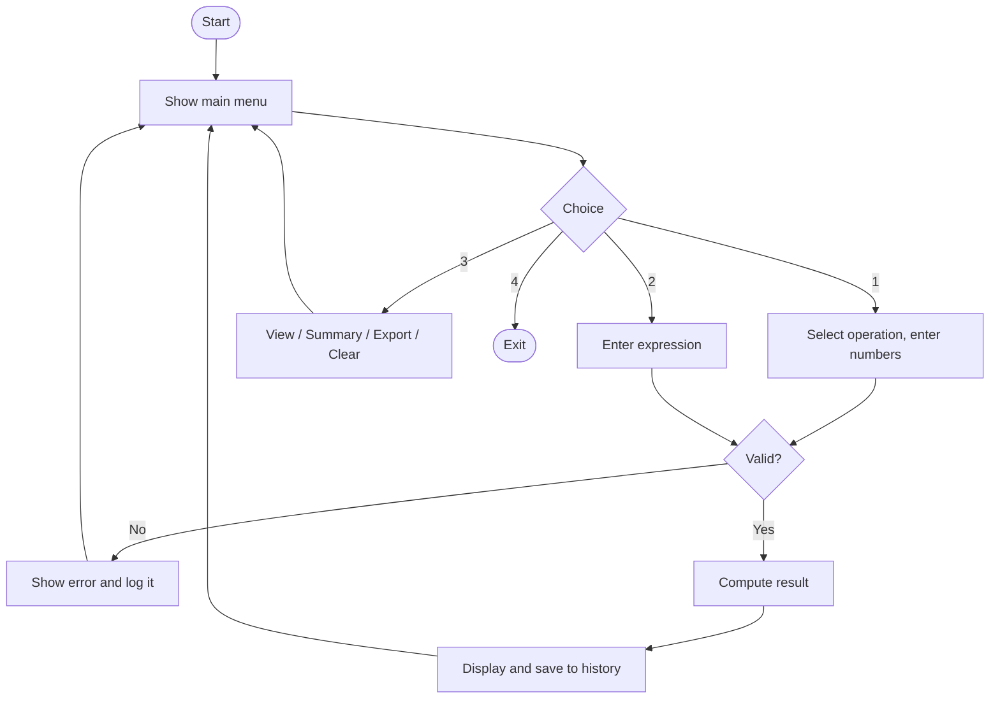
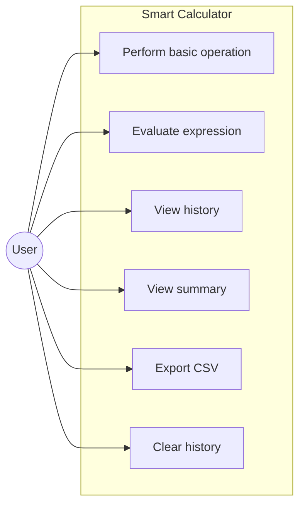
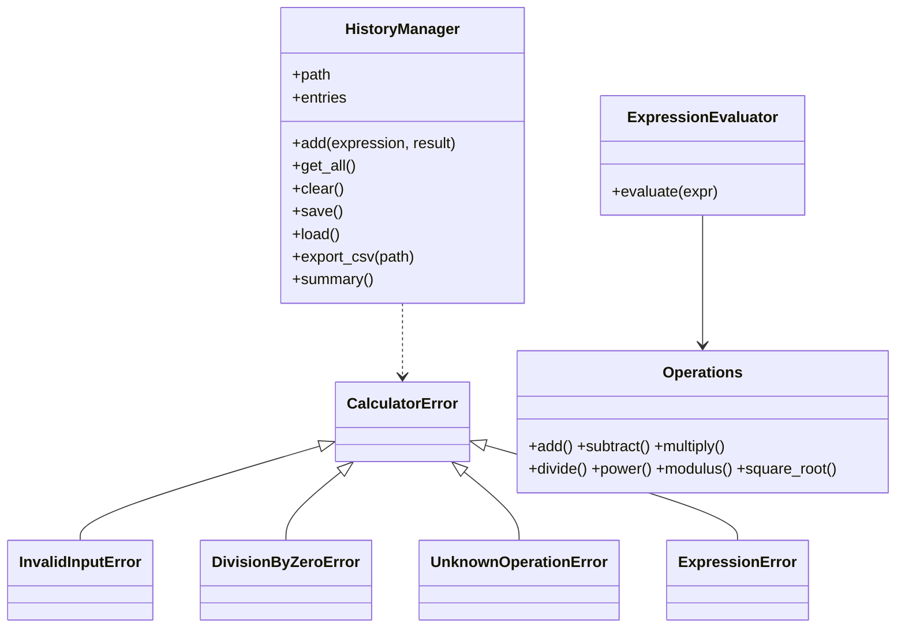

# Smart Calculator
A modular command-line calculator in Python with safe expression evaluation, persistent history, reporting, logging and unit tests.

## Overview
The project develops a simple menu calculator into an application with good software-engineering practice: layered modules, custom error handling, input validation, logging and automated tests.

The calculator uses three modules:
Module 1: Arithmetic operations: + -  / ^ % sqrt

Module 2: Expression evaluator: type 2 + 3 (4 - 1); parsed safely with ast (no eval)

Module 3: History & reports: saved to JSON, summary stats (count / average / min / max), CSV export, clear history
Various protections: division-by-zero, invalid input, overflow, and unsafe-code
Logging to logs/calculator.log
Bounded history (last 100 entries) for resource efficiency.
The project is implemented in Python 3.9+ (standard library only: ast, math, json, csv, logging, unittest), and uses Git for version control.

## Non-Functional Requirements Table
|Category |Implementation|
|---|---|
|Security |No eval; only numbers and arithmetic operators are allowed |
|Reliability |Corrupt history file is handled; app never crashes on bad input |
|Usability |Numbered menus, clear error messages, tidy number formatting |
|Maintainability |Small single-purpose modules, docstrings, config constants |
|Resource efficiency |History capped at 100 entries; exponent and expression length limits |
|Logging |Every operation and handled error is logged |

## Technologies Used
- Python 3.9+ (standard library only: ast, math, json, csv, logging, unittest)
- Git
  
## Project Structure
```
smart_calculator/
├── main.py         # entry point
├── calculator/
│  ├── __init__.py
│  ├── config.py      # constants
│  ├── exceptions.py    # custom exceptions
│  ├── logger.py      # logging setup
│  ├── validators.py    # input validation
│  ├── operations.py    # Module 1: arithmetic
│  ├── expression.py    # Module 2: safe evaluator
│  ├── history.py      # Module 3: history & reports
│  └── cli.py        # menu / workflow
├── tests/          # unit tests
├── docs/design.md      # architecture & UML diagrams
├── data/ logs/
├── statement.md
└── README.md
```

## Installation & Running
```bash
git clone
cd smart_calculator
python main.py
```
No packages need to be installed.
## Testing
```bash
python -m unittest discover -s tests -t . -v
```
## Sample Session
```
=== Smart Calculator ===
1. Basic Operation 2. Expression Evaluator 3. History & Reports 4. Exit
Enter choice (1-4): 2
Enter expression: 2 + 3 (4 - 1)
Result: 2 + 3 (4 - 1) = 11
```

## System Architecture


## Workflow Diagram

## Use Case Diagram


## Class / Component Diagram


## Design Decisions & Rationale
- **`ast` instead of `eval`:** prevents code injection.
- **Custom exception hierarchy:** one `except CalculatorError` in the CLI handles every expected failure.
- **Operation registry (dict):** adding a new operation needs one function and one registry line.
- **JSON storage:** human-readable, no database setup needed for a small project.
- **Layered design:** UI, logic, and storage are separate, so each can be tested alone.

